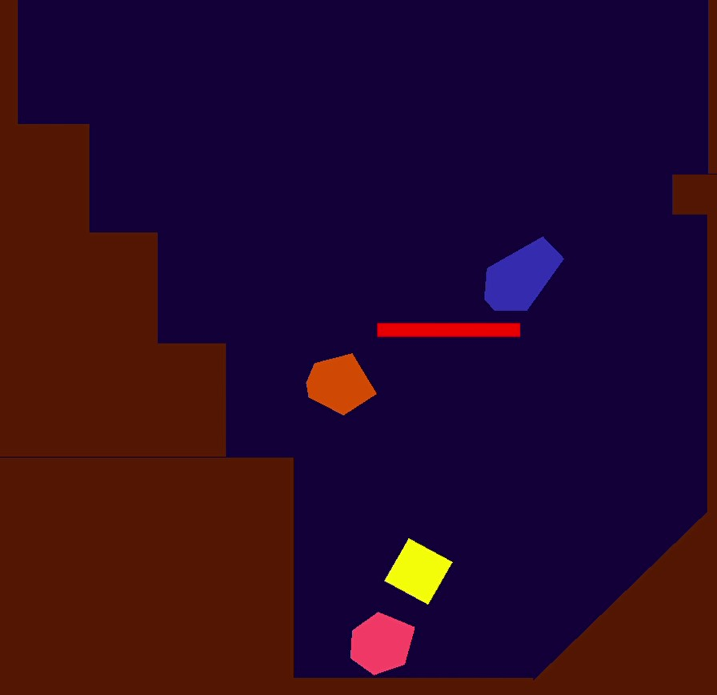
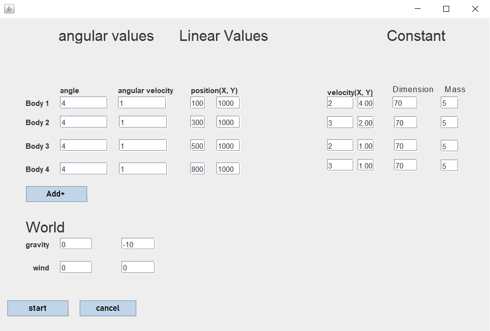
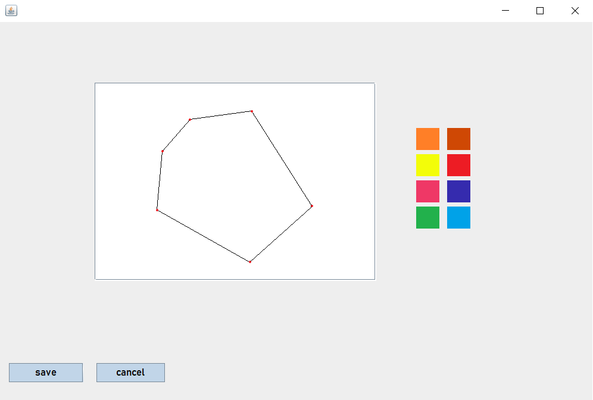
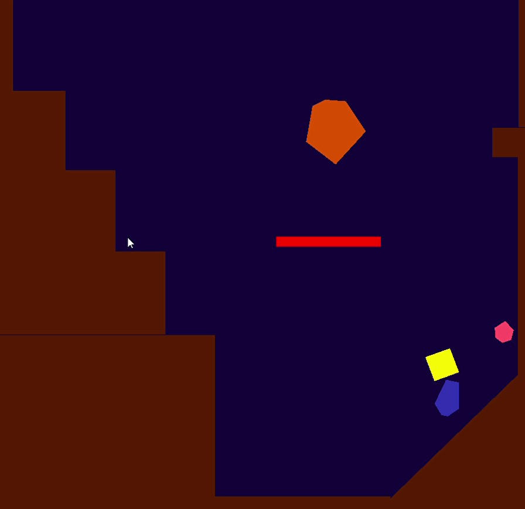
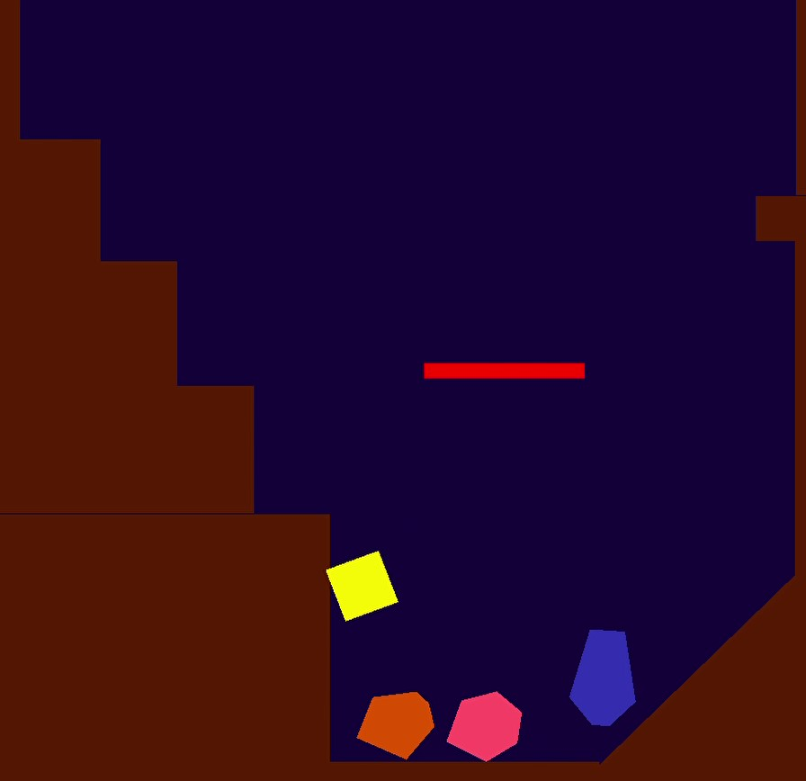

### About the Project:

## Physics Engine in Java and OpenGL

Developed a robust physics engine using Java and OpenGL, providing a platform for simulating complex physical interactions.Leveraged the power of OpenGL for efficient rendering and visualization of 2D polygons and their dynamic behavior.By reviewing the source code and physics concepts in my GitHub repository, you will gain valuable knowledge and qualifications necessary to create sophisticated physics-based games, akin to popular titles like brain-dots , brain-it-on! , draw-a-stickman and love-balls .
## Interactive Dashboard for Creating Custom Polygons and Customizing Body Parameters
Implemented an intuitive dashboard interface allowing users to create custom polygons/shapes and customize parameters for each individual body within the simulation.Provided controls to set initial angular and linear position, angle, mass and velocity for precise configuration of body dynamics.Empowered users to initiate simulation execution with the click of a button, facilitating seamless interaction and exploration of dynamic scenarios.
## Dynamic 2D Polygon Simulation
Implemented a dynamic simulation environment featuring 2D polygons falling from a height onto a cracked ground, enhancing challenge and realism.Designed the simulation to showcase realistic collisions and interactions between rigid bodies, accurately modeling physics principles.
## Integration of ODE Solver and Euler Method
Utilized an Ordinary Differential Equation (ODE) solver combined with the Euler method to simulate realistic physical behavior.Implemented advanced numerical methods to accurately model the dynamics of rigid bodies and their interactions within the simulation environment.
## In-depth Research and Reference Utilization
Conducted extensive research, drawing insights from physics textbooks and scientific computation research to inform the simulator's design and implementation.Incorporated findings from advanced physics concepts and computational methodologies to ensure fidelity and accuracy in the simulation's representation of physical phenomena.
## Visualization of Collision and Interaction Dynamics
Developed sophisticated visualization techniques with OpenGL to depict collision and interaction dynamics between rigid bodies.Enabled users to observe and analyze the complex behavior of polygons as they collide, deform, and interact with each other and the environment.

- [DEMO](https://drive.google.com/drive/folders/10ZuK_7OOMD-zlNDn203hk-63XNLrMH9M?usp=drive_link)
- [Documentaion](https://drive.google.com/file/d/1M2ZfLIHVgRsdZFarElK_tG0nd-avTB3H/view?usp=sharing) (in Arabic)

## Screenshots

